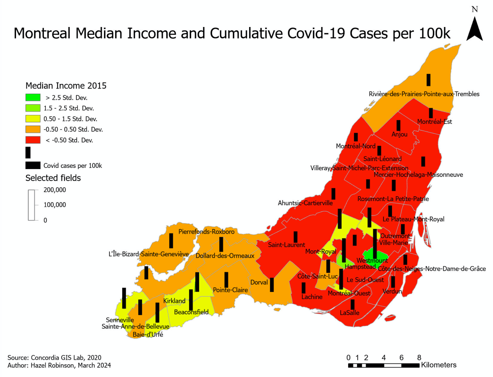
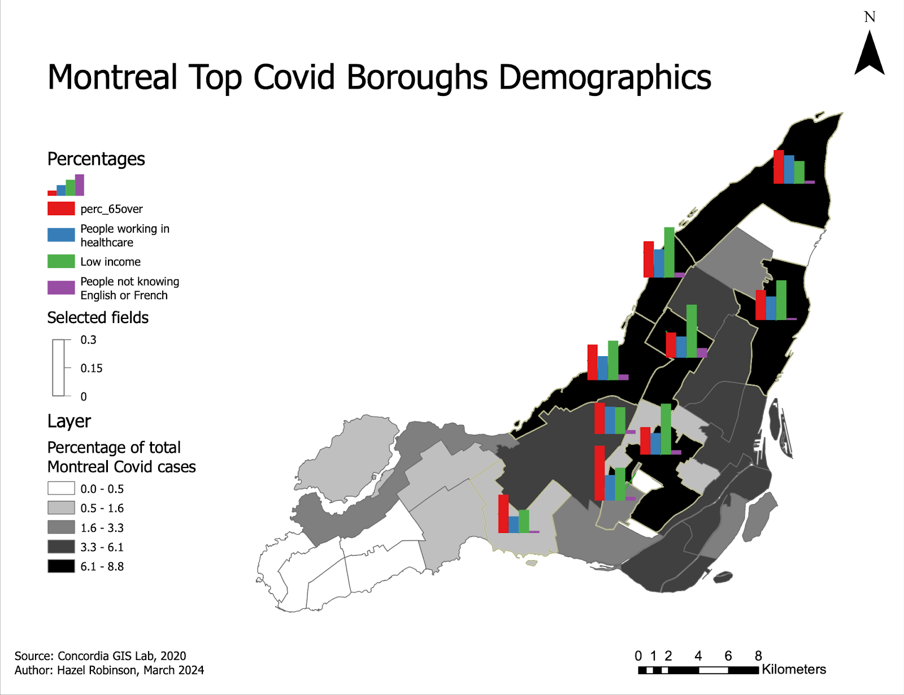

This project combined 2016 Census data [Statistics Canada] and 2020 COVID-19 case and mortality data to analyse and visualise socio-demographic vulnerability to COVID-19 across Montréal boroughs. The aim of this project was to identify boroughs at highest risk and inform public health planning. 
Vulnerability indicators were derived at the borough level and included: percentage of population aged 65+, median household income, proportion of low-income residents, proportion of healthcare workers, percentage of residents speaking neither English nor French, population density, and COVID-19 case and mortality rates.
Census tract-level data were spatially aggregated to borough boundaries using point-based spatial joins to avoid errors in polygon alignment. 

Source: <a href="https://github.com/jogarces/ics-313-text-game"><i class="large github icon "></i>jogarces/ics-313-text-game</a>
