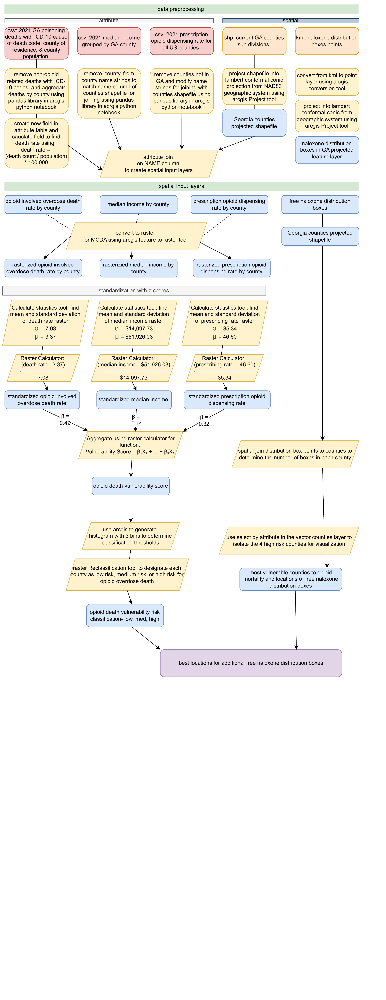

Opioid overdose death vulnerability rankings can be developed for counties by assessing socioeconomic and opioid-related indicators with opioid overdose mortality outcomes using a regression model approach (Sawyer et al., 2021, Van Handel et al., 2016).

You can learn more at the [UH Micromouse News Announcement](https://manoa.hawaii.edu/news/article.php?aId=2857).
