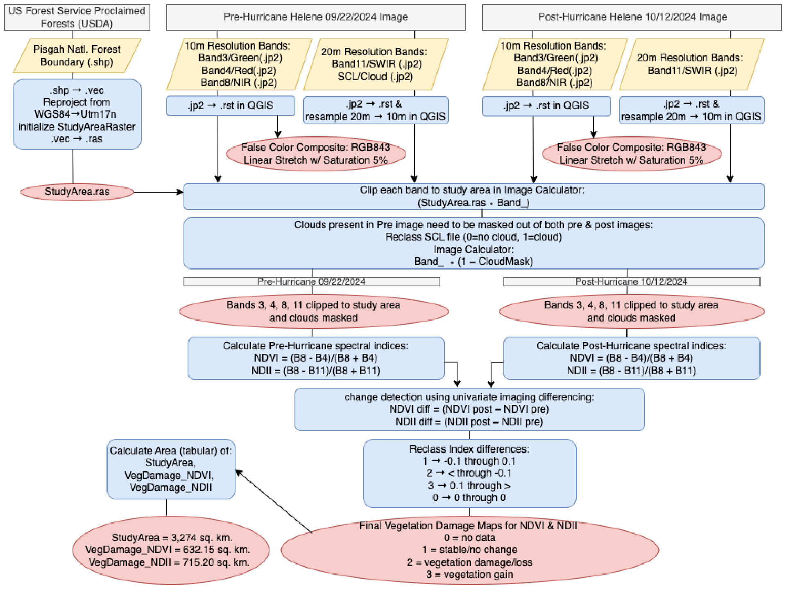

This project allowed me to understand the relevance and importance of the temporal scale of a project. Given the short timeline of this project and the connection to inclement weather, I had to employ cloud-masking and be thoughtful when selecting input data to retrieve most accurate data. 

In this project I gained experience moving project data between platforms (TerrSet and Arc GIS) in order to access the optimal tools for analysis (found in TerrSet for satellite imagery) and optimal tools for visualisation (ArcGIS for map-making). 

Here is the methodoloical flow chart outlining the steps undertaken to complete this project:

